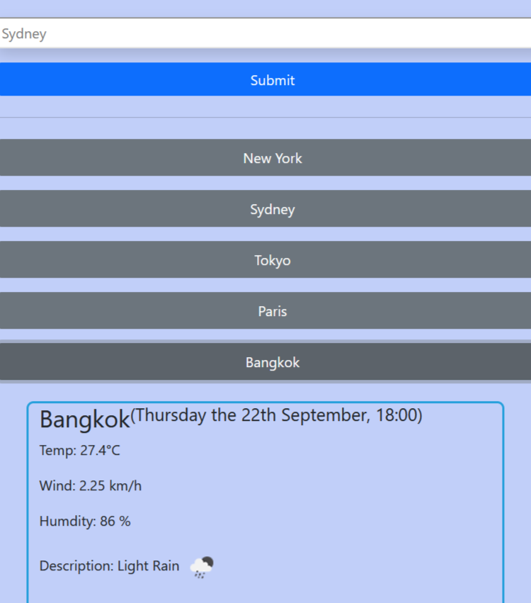

# kangazero.weatherdashboard.io

<!-- TABLE OF CONTENTS -->

  
Table of Contents

  <ol>
    <li><a href="#description">Description</a></li>
    <li><a href="#license">License</a></li>
    <li><a href="#contact">Contact</a></li>
    <li><a href="#acknowledgments">Acknowledgments</a></li>
  </ol>

<!-- ABOUT THE PROJECT -->
## Description

 
Desktop View

 
Mobile View

**What?**

This is a website that shows a 5-day weather forecast with the use of openweather API. 
The current day will show avaiable weather data closest to the current time. 
While the other 4 days will show data from one of 5 default timestamps included. 
The number of timestaps can be changed with the "cnt=[number]" parameter. 
However I only noticed it at the very end of implementing the javascript.

**Technologies**

This project ultilies a free API from [OpenWeather Doc](https://openweathermap.org/forecast5), which is fetched and dynamically rendered onto the index.html page with Javascript.
The HTML page itself is styled with a combination of base CSS and a third-party library called [Bootstrap](https://getbootstrap.com/docs/5.2/getting-started/introduction/).  

The 3rd-party library, [JQuery](https://jquery.com/) was initially included, however loading times were too long, and there was nothing beyond base Javascript needed for any of the functions used. 

Lastly, [Momentjs](https://momentjscom.readthedocs.io/en/latest/moment/04-displaying/01-format/) was used to parse and format dates to be consistent with the API's dates.

**Acquired Knowledge**

Throughout this mini project I have practiced quite a bit on using bootstrap, fetching API, understanding API parameters, and further understanding of base Javascript (mostly ES5 but also a bit of ES6). 

I also had to reinforce on "localStorage" and "array" methods, as I had and still have trouble understanding on how to store multiple values in one key on LocalStorage. 

I also managed to up my skills in ultising shortcuts in VScode thanks to this youtube tutorial, [VSCode pro tips](https://www.youtube.com/watch?v=ifTF3ags0XI). Tools such such multi-cursors, auto-highlighting, moving/copying lines, searching words within the code were very useful and saved a lot of manual work. 

(<a href="#readme-top">back to top</a>)

<!-- LICENSE -->
## License

Distributed under the MIT License. See `LICENSE.txt` for more information.

(<a href="#readme-top">back to top</a>)

<!-- CONTACT -->
## Contact

Samuel Wai Weng Yong - <a href="mailto:samuelyongw@gmail.com"> samuelyongw@gmail.com </a>

Project Link: [Weather-Dashboard](https://github.com/KangaZero/kangazero.weatherdashboard.io.git)

(<a href="#readme-top">back to top</a>)

<!-- ACKNOWLEDGMENTS -->
## Acknowledgments

Here are some of the resources used as reference to build this personal portfolio

* [Choose an Open Source License](https://choosealicense.com)
* [Bootstrap Doc](https://getbootstrap.com/docs/5.2/getting-started/introduction/)
* [Event - Current Target](https://developer.mozilla.org/en-US/docs/Web/API/Event/currentTarget)
* [Array methods](https://developer.mozilla.org/en-US/docs/Web/JavaScript/Reference/Global_Objects/Array)
* [momentjs doc](https://momentjscom.readthedocs.io/en/latest/moment/04-displaying/01-format/)

There were many bugs and troubles along the way, however I managed to overcome them thanks to my instructor's advice:

>"Be confident in using Google".

(<a href="#readme-top">back to top</a>)

Thanks for reading 😄!

