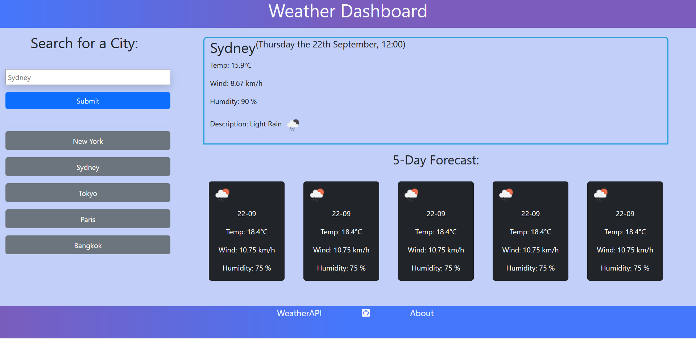

# kangazero.weatherdashboard.io

<!-- TABLE OF CONTENTS -->

  
Table of Contents

  <ol>
    <li>
      <a href="#description">Description</a>
    </li>
    <li><a href="#roadmap">Roadmap</a></li>
    <li><a href="#license">License</a></li>
    <li><a href="#contact">Contact</a></li>
    <li><a href="#acknowledgments">Acknowledgments</a></li>
  </ol>

<!-- ABOUT THE PROJECT -->
## Description

 
Desktop View

**What?**

**Technologies**

This project ultilies a free API from [OpenWeather Doc](https://openweathermap.org/forecast5), which is fetched and dynamically rendered onto the index.html page with Javascript.
The HTML page itself is styled with a combination of base CSS and a third-party library called [Bootstrap](https://getbootstrap.com/docs/5.2/getting-started/introduction/).  

**Why?**

**Acquired Knowledge**

(<a href="#readme-top">back to top</a>)

<!-- ROADMAP -->
## Roadmap
- [x] Basic html code 

 

Html-only

- [x] Add basic framework

Wireframe

- [x] Include Title and navigation
- [x] Main Content (About, Works, Contact)
- [x] Mobile responsive (screen-size)

Mobile view

(<a href="#readme-top">back to top</a>)

<!-- LICENSE -->
## License

Distributed under the MIT License. See `LICENSE.txt` for more information.

(<a href="#readme-top">back to top</a>)

<!-- CONTACT -->
## Contact

Samuel Wai Weng Yong - <a href="mailto:samuelyongw@gmail.com"> samuelyongw@gmail.com </a>

Project Link: [Weather-dashboard](https://github.com/KangaZero/kangazero.weatherdashboard.io.git)

(<a href="#readme-top">back to top</a>)

<!-- ACKNOWLEDGMENTS -->
## Acknowledgments

Here are some of the resources used as reference to build this personal portfolio

* [Choose an Open Source License](https://choosealicense.com)
* [Malven's Flexbox Cheatsheet](https://flexbox.malven.co/)
* [CSS-gradient](https://cssgradient.io/)
* [Color-theory](https://www.invisionapp.com/inside-design/understanding-color-theory-the-color-wheel-and-finding-complementary-colors/)
* [Email-tag](https://www.w3schools.com/tags/tag_address.asp)
* [Call-tag](https://www.elegantthemes.com/blog/wordpress/call-link-html-phone-number#:~:text=Adding%20an%20HTML%20Phone%20Number%20Call%20Link%20to%20your%20Website&text=Href%3Dtel%3A%20creates%20the%20call,the%20number%20it%20will%20call.)
* [Glowing-text](https://www.w3schools.com/howto/howto_css_glowing_text.asp)

In addition to these links, I would like to acknowledge and credit the help I had from a tutor in a one-on-one session. They have helped me in making my website suited for mobile screens, and cleaned up some code. 

Here are their contact details:
- Name: Andrew Mason
- Email: <a href="mailto:amason@instructors.2u.com"> amason@instructors.2u.com </a>

(<a href="#readme-top">back to top</a>)

Thanks for reading 😄!

